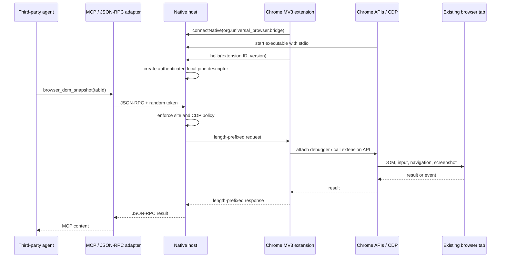

# Architecture

## Design objective

The project mirrors the observable layered process of the current Codex Chrome integration while replacing every proprietary component with independently written code and open platform interfaces.

## Components

### Chrome extension

`extension/background.js` is a Manifest V3 service worker. It initiates Chrome Native Messaging, dispatches browser methods, keeps a bounded debugger-event buffer, and adds an extension-local blocklist and kill switch.

Before attaching `chrome.debugger`, the service worker dynamically injects a foreign-extension-frame monitor only into the tab being controlled. The monitor navigates iframe/frame elements whose source belongs to another extension to `about:blank`, then removes each element after the safe navigation commits. This includes frames added later or placed inside already-discovered open or closed shadow roots. Chrome checks both the committed URL and the frame's security principal when granting debugger access, so the bridge waits for the redirected frame to disappear before attaching.

Shadow roots are discovered during initial scanning and observable DOM mutations. A new shadow root attached later to an already-connected host may remain undiscovered until a relevant rescan; this case is not guaranteed by the current implementation. The standard page path and an explicit web-accessible foreign-extension iframe path are validated on Chrome 152.

The extension uses two control planes:

1. Chrome extension APIs for tabs, tab groups, history, bookmarks, downloads, and Native Messaging.
2. `chrome.debugger` for CDP domains such as Runtime, Page, DOM, Accessibility, and Input.

The high-level locator API is implemented on top of DOM inspection plus CDP input dispatch. It intentionally exposes a smaller surface than upstream Playwright.

### Native Messaging Host

`src/native-host.mjs` is packaged as a standalone executable with Node's Single Executable Application facility. Chrome starts it using a manifest whose `allowed_origins` contains only the installed extension ID.

Native messages are JSON payloads preceded by a four-byte little-endian length. The host's stdout is reserved exclusively for this framing; logs go to stderr.

The host creates one authenticated local IPC endpoint per extension instance:

- Windows: named pipe
- macOS/Linux: Unix-domain socket

Descriptors are stored beneath the current user's application-data directory. They contain an instance ID, endpoint, process ID, creation time, and a random 256-bit bearer token.

### Bridge client

`src/bridge-client.mjs` discovers live descriptors, removes stale descriptors, selects the newest instance by default, and sends one newline-delimited JSON-RPC request per connection.

The explicit `UNIVERSAL_BROWSER_INSTANCE_ID` selection mechanism corresponds to choosing a particular Chrome extension/profile instance.

### MCP adapter

`src/mcp-server.mjs` implements MCP over stdio. It never receives browser credentials. It maps narrowly described tools to bridge methods and converts screenshots to MCP image content.

### Policy

The Native Host is the authoritative enforcement point. Before forwarding a page command it resolves the tab's current URL and checks the effective site policy. Raw CDP uses a separate method allowlist. History, bookmark, and download metadata has an independent off-by-default switch.

The extension-side blocklist is defense in depth and can stop actions even when a third-party client possesses the runtime token.

## Request lifecycle

1. The agent calls a focused MCP tool or JSON-RPC method.
2. The adapter discovers the selected bridge instance and authenticates using its runtime descriptor.
3. The Native Host validates the method and parameters.
4. For a tab-scoped command, the host first reads the tab URL and enforces site approval.
5. For raw CDP, the host checks the CDP method allowlist.
6. The host sends a Native Messaging request to the extension.
7. The extension applies its local enabled/blocklist settings.
8. The extension executes a Chrome API or CDP operation.
9. The response returns over the same layers.
10. Page/debugger events are stored with monotonic cursors for later retrieval.

## Process and failure boundaries

- If Chrome closes the Native Messaging port, the host removes its descriptor and exits.
- If an MV3 service worker is suspended, the alarm/reconnect path recreates the Native Messaging connection.
- If a debugger is already attached by DevTools or another extension, Chrome may reject attachment; this is returned as a browser error.
- Debugger initialization is serialized per tab. A tab is recorded as attached only after `Page.enable` and `Runtime.enable` both succeed; partial initialization is detached and cleared before the error is returned.
- Explicit detach and asynchronous `onDetach` monitor cleanup form a barrier before another initialization. A late detach event cancels an in-flight initialization safely; Chrome events do not carry this controller's generation token, so a late event is not assumed to belong to an older session.
- Monitor injection confirms returned document IDs against a fresh frame inventory. Navigation retries are bounded; incomplete coverage fails before debugger attachment.
- A child frame observed as a foreign-extension frame is temporarily excluded while its safe `about:blank` navigation commits. The monitor then removes the element, and attachment waits until its frame ID disappears. Ordinary page-owned `about:blank` and all `about:srcdoc` documents receive monitors; the top frame always remains eligible.
- Page operations wait for an in-flight post-navigation monitor refresh. A failed refresh invalidates control and detaches the debugger before later operations can proceed.
- Navigation destroys document-scoped monitors, so controlled tabs reinstall the monitor on loading and frame commits. Explicit detach removes its observers. Removed frames are not restored automatically; reloading lets their owning extension recreate them.
- Requests default to a 30-second timeout.
- A stale descriptor is removed after connection probing fails.
