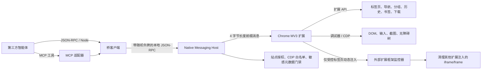

# Lingee Chrome Agent Bridge 续作交接

## 最新续作状态（2026-09-15，本节优先于下方历史交接）

0.1.12/remove-after-blank-v11 已通过真实 Chrome 152 的基础 E2E，以及 10/10 轮 Surfingkeys 增强 iframe 压力回归。随后按用户指定，将产品名统一为 **Lingee Chrome Agent Bridge**，并把 `https://test.lingee.com/favicon-32x32.png` 的原始 48×48 PNG 配置为扩展和工具栏图标。0.1.14 新增可见虚拟鼠标：语义点击、坐标移动/点击、滚轮和拖拽都会显示 Lingee 箭头，点击带脉冲反馈；待用户重新加载后执行真实 Chrome 验收。Native Messaging 主机名等内部兼容标识保持不变。

- `src/version.mjs` 让 Host/MCP 版本统一来自 package.json；0.1.14 Host 已构建安装，manifest、图标和 `virtual-cursor.js` 已同步。安装器使用带构建哈希的文件名，避免覆盖运行中的旧文件。
- 新增 `extension/virtual-cursor.js`，使用封闭 Shadow DOM、无命中测试的顶层覆盖层；动作失败与光标绘制失败相互独立，detach 时清理。E2E 通过 `overlay-v1` 标记和页面宿主状态验证真实注入。
- 浏览器控制 Skill 已更名为 `lingee-chrome-control`，UI 显示名为 `Lingee Chrome Control`；仓库和本机安装目录均已迁移，旧目录不再保留。
- E2E 在打开标签页前检查 Host/扩展版本及兼容性标记；输出运行版本证据。外部 frame 检查改为读取测试页自行呈现的中和状态，不调用原始 CDP。
- 修复 onDetach 异步清理与重新 ensure 的竞态，新增等待屏障。晚到的 detach 事件会安全取消初始化，清理后可重试；不假设 Chrome 事件携带本项目世代信息。
- 新增 `extension/monitor-injection.js`：按真实注入返回 documentId 缓存，重新枚举确认活动文档覆盖，并使用最多 20 轮、每轮 25ms 的有界稳定化重试。修复 fallback 成功仍误报失败、缓存旧 documentId 及销毁中子文档造成的瞬时误判。
- 监控器同时观察 src/srcdoc；发现外部扩展 frame 后移除 srcdoc、导航至 about:blank，并在安全提交的 load 事件中移除元素；后台等待归因 frameId 消失后再附加调试器。
- 源码六个 JavaScript 运行文件已复制到原部署目录，包括 **monitor-injection.js** 和 **virtual-cursor.js**。后续同步必须包含这两个文件。
- 最新标记为 **remove-after-blank-v11 / generation-v4 / counts-v2 / overlay-v1**；下方历史示例中的旧标记已过时。
- 已确认 Surfingkeys 本机 manifest 版本 **1.19.1**，`pages/frontend.html` 属于 `<all_urls>` 的 web_accessible_resources；该 URL 的真实回归已通过。
- 最终测试和审查记录见 [本轮验证记录](./VALIDATION-2026-09-11.md)。当前修改均保留在 main 工作区，尚未提交。
- 独立终审确认一个剩余 P2 限制：已连接 host 在监控安装后才创建 shadow root 时，根发现可能遗漏。架构文档已明确此限制，后续需设计可控成本的发现机制；现有测试通过不代表覆盖此场景。

下一步：用户重新加载扩展后确认 0.1.14 和 `overlay-v1`，执行基础真实 E2E，并保存截图目视检查箭头和点击脉冲。可后续处理已记录的 late shadow-root 发现限制。

---

以下为本轮续作前的历史交接，保留用于追溯：

更新日期：2026-09-11  
工作目录：`E:\AI\codex\workspace\chrome`  
当前分支：`main`  
当前源码版本：`0.1.2`

## 1. 项目目标与边界

本项目是一个可供第三方智能体调用的 Chrome 通用控制桥。它复现 Codex Chrome 集成的可观察分层方式：智能体通过 MCP、JSON-RPC 或 Node 客户端调用本机桥，桥通过 Chrome Native Messaging 与 Manifest V3 扩展通信，再使用 Chrome 扩展 API 和 `chrome.debugger`/CDP 操作用户当前浏览器。

项目采用独立实现，不复制 OpenAI 私有代码、协议、扩展身份、品牌资源或认证基础设施。因此“贴近 Codex”指架构角色和可观察能力接近，并不代表二进制、私有协议或扩展 ID 兼容。详细差异见 [CODEX-DIFFERENCES.md](./CODEX-DIFFERENCES.md)。

本阶段暂不继续生成或美化 HTML 文档站；当前重点是把真实 Chrome 控制链路跑通。

## 2. 当前架构



### 调用链

1. 调用方使用 `src/mcp-server.mjs`、`src/jsonrpc-cli.mjs` 或 `src/bridge-client.mjs`。
2. 客户端从当前用户的运行时目录发现 Chrome 实例，并用描述文件中的随机令牌连接本地命名管道。
3. `src/native-host.mjs` 执行站点授权、敏感元数据开关和原始 CDP 白名单检查。
4. Native Host 通过标准输入/输出的 Chrome Native Messaging 帧把请求发给扩展。
5. `extension/background.js` 分派方法，并执行扩展侧阻止名单检查。
6. 需要 CDP 的操作先安装外部扩展框架监控器，再由 `extension/debugger-controller.js` 串行完成调试器附加及 `Page.enable`、`Runtime.enable`。
7. 扩展把结果沿原链路返回；调试器事件进入有界事件缓冲区。

### 核心文件职责

| 文件 | 职责 |
|---|---|
| `extension/background.js` | MV3 后台服务、Native Port、方法分派、事件缓存、扩展侧策略、监控器注入 |
| `extension/debugger-controller.js` | 每标签页附加状态、初始化互斥、世代令牌、分离竞态处理、失败回滚 |
| `extension/foreign-frame-monitor.js` | 清理其他扩展注入的 `chrome-extension://` iframe/frame，监听动态 DOM、属性变化及开放/封闭 Shadow DOM |
| `src/native-host.mjs` | Native Messaging 主机、本地命名管道、认证、策略执行、请求转发 |
| `src/bridge-client.mjs` | 实例发现、陈旧描述文件处理、实例选择、本地 JSON-RPC 客户端 |
| `src/mcp-server.mjs` | MCP stdio 工具适配 |
| `src/policy.mjs` | 站点许可/阻止、敏感元数据开关、CDP 方法许可 |
| `scripts/chrome-e2e.mjs` | 本机真实 Chrome 端到端测试夹具 |
| `skills/lingee-chrome-control/` | 跨工具通用 Skill、调用脚本、诊断脚本及安全/工具/排障参考 |

## 3. 本轮已经完成

### 调试器生命周期

- 新增每标签页初始化互斥，多个并发 `ensure` 只执行一次附加流程。
- 使用世代令牌防止已覆盖的 `onDetach`、显式 detach 与初始化 Promise 交错后产生“幽灵附加”状态。
- 控制器内新的初始化会等待旧的 detach Promise 清理完成；真实 Chrome 中晚到的 `onDetach` 事件仍需 E2E 或更精确的 API 模拟确认。
- 只有监控器安装、`chrome.debugger.attach`、`Page.enable`、`Runtime.enable` 全部成功后才记录已附加状态。
- 任一步骤失败都会清理状态并尝试分离，不再返回虚假的已附加状态。
- Native Port 响应绑定到发起请求的 Port，避免重连期间把响应发给错误实例。

### Chrome 152+ 外部扩展框架兼容

- 在受控标签页附加调试器之前动态注入监控器，不做全局内容脚本注入。
- 使用 `webNavigation.getAllFrames()` 获取活动文档，并按 `documentId` 单独注入、重试和跟踪。
- 监控已有节点、后续新增节点、`src` 属性变化、开放与封闭 Shadow DOM。
- 外部扩展 iframe 置为 `srcdoc=""`，frame 置为 `about:blank`。
- 导航和 frame commit 时刷新；显式 detach 和标签页关闭时清理。
- 若任一仍活动的页面文档无法安装监控器，或外部扩展 frame 未在等待期内失效，则在附加前返回 `FOREIGN_FRAME_MONITOR_FAILED`。
- 标签页被 Chrome 替换时采取安全清理，并记录包含新标签页 ID 的 `Browser.tabReplaced` 事件；不会绕过主机授权自动继承控制权。

### 测试与文档

- 新增调试器控制器单元测试和外部 frame 监控器行为测试。
- 新增真实浏览器 E2E 脚本，覆盖：启动本地页面、授权、打开标签、claim、读取 DOM、点击、验证结果、清理。
- 可选外部扩展 frame 回归测试通过环境变量启用。
- README、架构、安全、Codex 差异以及 Skill 的工具/安全/排障说明已经更新。
- 仓库 Skill 已同步到 `C:\Users\fcliq\.codex\skills\lingee-chrome-control`；此前同步后哈希一致。
- 最新自动化结果：`npm run check` 通过，`npm test` 为 56/56 通过，`git diff --check` 无错误。

## 4. 当前精确断点

源码扩展的四个运行文件已经复制到 Chrome 实际加载的解包目录：

`E:\AI\lingee\workspace\control-chrome\extension`

已同步并核对 SHA-256 一致的文件：

- `manifest.json`
- `background.js`
- `debugger-controller.js`
- `foreign-frame-monitor.js`

该部署目录不是 Git 仓库，只是 Chrome 当前使用的部署副本。不要在此处作为主源码开发；修改应先进入本仓库，再同步过去。

同步完成时 Chrome 根进程仍是 PID `36024`，命令行为 Chrome 打开 `about:blank`。它是本轮测试主动启动的 Chrome；同步 0.1.2 后尚未重启。因此磁盘上虽然是 0.1.2，当前服务工作线程是否已加载 0.1.2 尚未验证。新会话开始时必须重新查询进程，不能假设 PID 仍然存在或仍属于测试实例。

## 5. 上一次真实浏览器测试结果

在同步最新 0.1.2 之前，基础 E2E 在 `browser.claimTab` 失败，Chrome 返回：

```text
Debugger is not attached to the tab with id ...
```

更早一次测试遇到的是外部扩展 frame 导致的调试器限制，因此本轮加入了受控标签页监控器。最新 0.1.2 又为 `browser.claimTab` 增加分阶段错误前缀，并在 `browser.getInfo` 增加兼容性标记，以便判断实际加载版本和失败位置。

预期的新错误格式类似：

```text
browser.claimTab/foreign-frame-monitor: ...
browser.claimTab/debugger.attach: ...
browser.claimTab/Page.enable: ...
browser.claimTab/Runtime.enable: ...
browser.claimTab/claim: ...
```

真实 E2E 尚未在加载 0.1.2 后重新执行，这是当前最重要的未完成项。

## 6. 下一会话建议按此顺序继续

### 第一步：确认仓库状态

```powershell
Set-Location 'E:\AI\codex\workspace\chrome'
git branch --show-current
git status --short
npm run check
npm test
```

预期分支为 `main`，自动化测试为 56/56。工作区当前包含本轮尚未提交的预期修改，详见第 8 节。不要覆盖或重置这些修改。

### 第二步：确认部署副本仍同步

比较本仓库与部署目录中以下四个文件的 SHA-256。若不一致，从本仓库复制到部署目录：

```powershell
$sourceRoot = 'E:\AI\codex\workspace\chrome\extension'
$deployedRoot = 'E:\AI\lingee\workspace\control-chrome\extension'
$names = @('manifest.json', 'background.js', 'debugger-controller.js', 'foreign-frame-monitor.js')
foreach ($name in $names) {
  Get-FileHash -Algorithm SHA256 -LiteralPath (Join-Path $sourceRoot $name)
  Get-FileHash -Algorithm SHA256 -LiteralPath (Join-Path $deployedRoot $name)
}
```

### 第三步：重启测试 Chrome 并确认加载版本

先只读检查所有 Chrome 根进程及命令行。交接记录中的 PID 和普通 `chrome.exe about:blank` 命令行不能在新会话中唯一证明进程仍为测试专用：PID 可能被复用，默认 Chrome 配置也可能已经承载用户标签页。

只有当进程带有本项目事先创建的唯一测试 profile/marker，并且已经复核该 profile 的绝对路径属于明确的测试目录时，才可自动终止。当前进程不是用唯一测试 profile 启动的，因此新会话不得仅凭 PID `36024` 自动终止它。若无法安全确认，请停止自动重启，明确请用户手动完全退出并重新打开 Chrome，待用户确认后再继续。不要为方便测试擅自创建或迁移用户配置。Chrome 重新启动后再以可见窗口打开 `about:blank`。

设置 Bridge 根目录并发现实例：

```powershell
$env:UNIVERSAL_CHROME_BRIDGE_ROOT = 'E:\AI\codex\workspace\chrome'
node 'C:\Users\fcliq\.codex\skills\lingee-chrome-control\scripts\invoke.mjs' instances
```

选择新实例后调用：

```powershell
$env:UNIVERSAL_BROWSER_INSTANCE_ID = '<新的实例 ID>'
node 'C:\Users\fcliq\.codex\skills\lingee-chrome-control\scripts\invoke.mjs' call browser.getInfo '{}'
```

必须确认扩展版本为 `0.1.2`，并出现类似以下兼容性标记：

```json
{
  "foreignFrameMonitor": "document-id-v1",
  "debuggerState": "generation-v1"
}
```

若没有这些标记，说明 Chrome 没有运行当前代码，此时不要继续分析 E2E 错误。

### 第四步：执行基础真实浏览器 E2E

```powershell
$env:UNIVERSAL_BROWSER_INSTANCE_ID = '<新的实例 ID>'
node scripts/chrome-e2e.mjs
```

脚本会启动本地 HTTP 夹具并自动清理其标签页和服务器。根据 `browser.claimTab/<阶段>` 定位失败：

| 阶段 | 优先检查 |
|---|---|
| `foreign-frame-monitor` | `getAllFrames`、按 documentId 注入结果、外部 frame 是否真正失效 |
| `debugger.attach` | DevTools 或另一扩展是否已经占用调试器 |
| `Page.enable` / `Runtime.enable` | attach 是否被错误地当成成功，或附加后立即被另一方解除 |
| `claim` | 标签页读取、扩展侧阻止名单及参数校验 |

如果 `chrome.debugger.attach` 报“已有调试器附加”，控制器目前会尝试发送 CDP 命令来判断是否是本扩展已有的附加。如果命令随后失败，应返回稳定、分阶段的错误，不能把标签页记为已附加。不要为了通过测试而禁用其他扩展、扩大 Chrome 启动参数或绕过授权策略。

### 第五步：执行外部扩展 frame 回归

当前 Chrome 中观察到 Surfingkeys 扩展 ID：`gfbliohnnapiefjpjlpjnehglfpaknnc`，此前观察版本为 1.19.0。先只读检查该扩展 manifest 的 `web_accessible_resources`，确认可公开加载的页面路径，不要凭猜测使用路径。

确认 URL 后执行：

```powershell
$env:UNIVERSAL_BROWSER_E2E_FOREIGN_FRAME_URL = 'chrome-extension://gfbliohnnapiefjpjlpjnehglfpaknnc/<已确认的公开页面>'
npm run test:chrome:foreign-frame
```

该测试必须证明 frame 被中和，同时普通 DOM 读取、点击及结果验证仍成功。

### 第六步：终审与收尾

- 请独立审查代理复查最终差异，重点看竞态、失败回滚、documentId 生命周期、真实测试是否覆盖实际注入路径。
- 再运行 `npm run check`、`npm test`、`git diff --check`。
- 检查仓库 Skill 与已安装 Skill 是否仍一致；若 Skill 文件有新改动，再同步一次。
- 根据用户指示决定是否提交。当前用户要求在 `main` 本地工作，但本轮修改尚未提交；不要擅自丢弃修改。

## 7. 仍需处理或确认的事项

### 必须完成

1. 重启 Chrome 后确认 0.1.2 和兼容性标记真正生效。
2. 跑通基础真实 Chrome E2E，或用分阶段错误确定并修复根因。
3. 使用一个经 manifest 确认可访问的外部扩展页面跑通 frame 回归测试。
4. 在所有修复后完成独立终审和全量自动化复测。

### 建议补齐

1. `src/native-host.mjs` 的 `bridge.getInfo` 仍硬编码版本 `0.1.0`，与包和扩展的 `0.1.2` 不一致。建议改为单一版本来源或同步更新，并补测试。
2. 真实 `chrome.scripting` / `webNavigation` API 的模拟测试仍可加强；现有监控器测试有行为 DOM 夹具，但后台注入流程主要依赖结构检查和真实 E2E。
3. `tabs.onReplaced` 当前只安全清理旧标签页并发事件，不自动迁移控制。此选择避免绕过主机授权，应在需要自动迁移前先设计重新授权机制。
4. 控制器单元测试覆盖了初始化期间的 `onDetach` 和 detach Promise 互斥，但还需模拟或真实验证一种更晚时序：旧 detach Promise 已结束、新 ensure 已开始之后，Chrome 才送达旧会话的 `onDetach`。需要确认该事件不会使新会话失效或产生错误状态。
5. Native Host 的 `dist` 可执行文件可能早于最新源码。源码稳定后需要重新 `npm run build:host`，再按安装流程更新；不要把旧 `dist` 的行为当成最新源码行为。
6. 生产级缺口仍包括集成式用户同意界面、安全凭据输入、签名发布与自动更新、视觉推理循环、更完整的下载生命周期和进一步安全加固。

## 8. 当前未提交工作区

以下是交接时的预期修改，不应被重置：

```text
 M README.md
 M docs/ARCHITECTURE.md
 M docs/CODEX-DIFFERENCES.md
 M docs/SECURITY.md
 M extension/background.js
 M extension/manifest.json
 M package-lock.json
 M package.json
 M skills/lingee-chrome-control/references/security.md
 M skills/lingee-chrome-control/references/tools.md
 M skills/lingee-chrome-control/references/troubleshooting.md
?? extension/debugger-controller.js
?? extension/foreign-frame-monitor.js
?? scripts/chrome-e2e.mjs
?? test/debugger-controller.test.mjs
?? test/foreign-frame-monitor.test.mjs
?? docs/HANDOFF.md
```

交接时 `HEAD` 为：

```text
6898430 fix(skill): address final universal Chrome review
```

## 9. 安全与操作约束

- Native Host 是站点授权和 CDP 白名单的权威执行点；扩展侧阻止名单是纵深防御。
- 不在输出、日志或文档中记录运行时描述文件里的 bearer token、命名管道认证数据或其他秘密。
- `chrome://extensions` 通过自动化浏览器访问曾被安全策略明确阻止，不应尝试使用替代自动化通道绕过。
- 不禁用用户的其他扩展来掩盖兼容性问题。
- 不对来源不明的 Chrome 进程执行终止操作。
- 不自动把被 Chrome 替换后的新标签页视为已授权。
- 不使用 OpenAI 私有扩展 ID、Native Host 名称或私有协议作为本项目的兼容接口。

## 10. 新会话可直接使用的续作提示

```text
请读取 E:\AI\codex\workspace\chrome\docs\HANDOFF.md，并从“当前精确断点”继续。使用 lingee-chrome-control Skill。先确认工作区和部署副本，不要重置未提交修改；重启本轮测试 Chrome 后验证 browser.getInfo 为 0.1.2 且包含兼容性标记，再运行基础真实 Chrome E2E。根据 browser.claimTab 的阶段化错误修复根因，然后完成经 manifest 验证的外部扩展 frame 回归测试。全程保持现有安全策略，最终让独立子代理审查，并运行 check、全部测试和 git diff --check。
```
